# Práctica 2 

## Preparación en instalación de la red
**Cliente Windows:**
Vamos a instalar una máquina virtual con el sistema operativo Windows. Esta máquina tendrá un adaptador de red configurado para funcionar en red interna, a la que llamaremos SRI200. El nombre que daremos a esta máquina será W-LAURA.

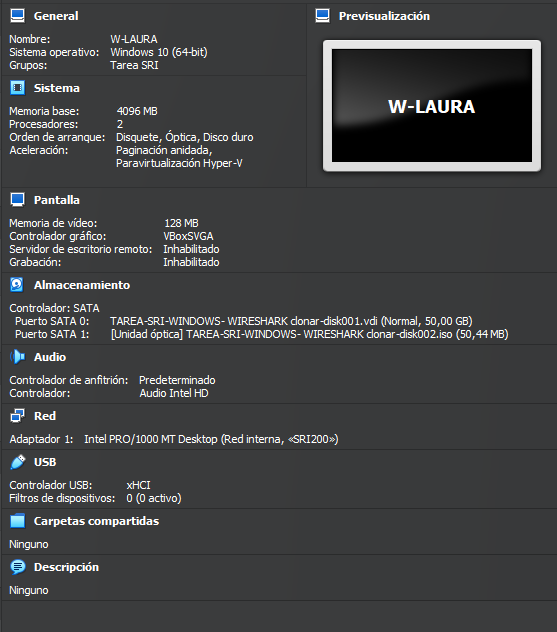

Configuramos el cliente de Windows para que obtenga su dirección IP de forma automática a través de un servidor DHCP. 
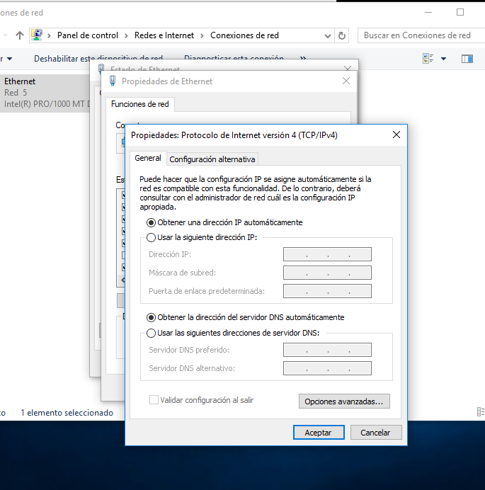
 
**Router Pfsese:**

En el siguiente paso, vamos a instalar el router PfSense, que será el encargado de gestionar la red. Este router tendrá dos adaptadores de red: el primero estará en modo adaptador puente para conectarse a la red externa y permitir el acceso a Internet, y el segundo en red interna SRI200 para comunicar con las máquinas virtuales.

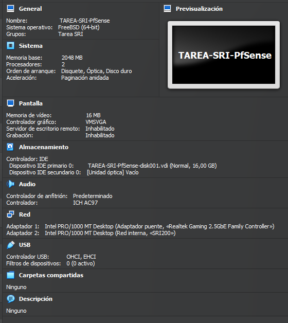

Asignamos la dirección IP 10.0.200.1 al router, que será la puerta de enlace de nuestra red interna. Además, desactivamos el servidor DHCP en esta interfaz para evitar conflictos con el servidor DHCP que configuraremos más adelante en otra máquina.

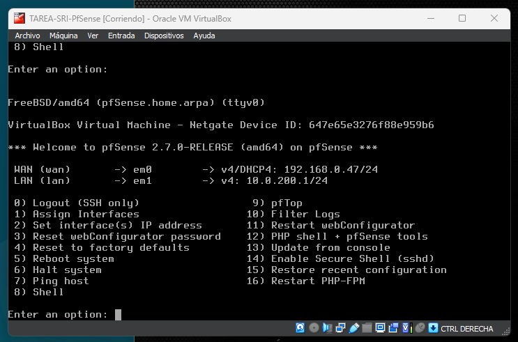

**Cliente Debian:**

Instalamos una máquina virtual con el sistema operativo Debian Server para simular un cliente Linux. A esta máquina le asignaremos un único adaptador de red en red interna SRI200, y la llamaremos U-LAURA.

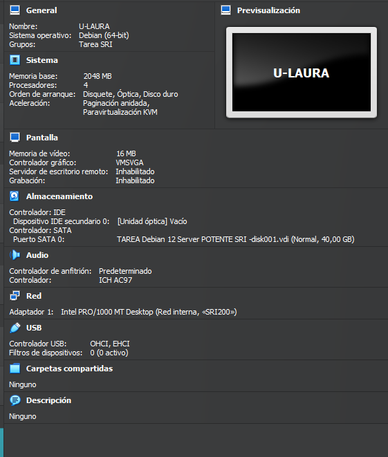

Configuramos esta máquina para que obtenga su dirección IP mediante DHCP. Para lograr esto, editamos el archivo /etc/network/interfaces, donde especificamos que la interfaz de red debe configurarse automáticamente.es

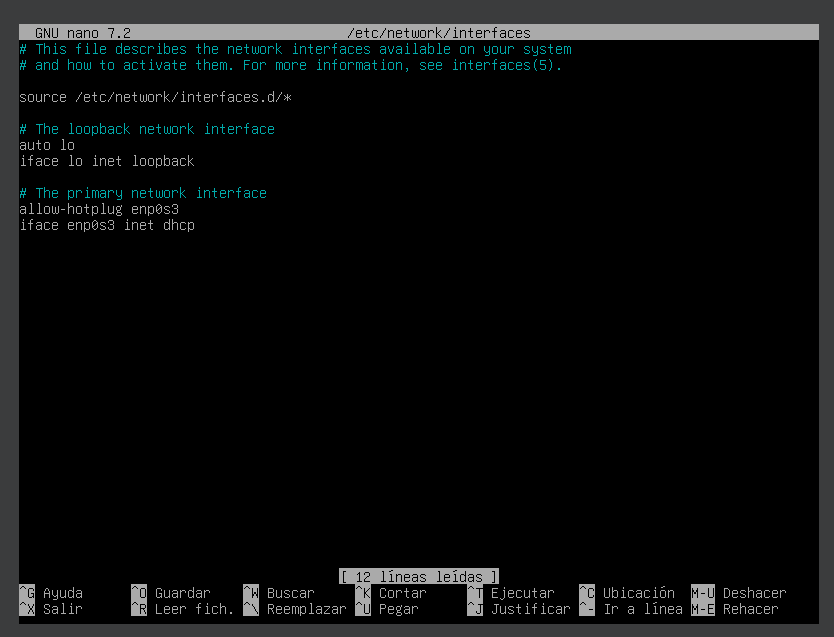

**Servidor Debian:**

Ahora instalamos otra máquina virtual con el sistema operativo Debian, que funcionará como servidor en nuestra red interna. Esta máquina tendrá un adaptador de red configurado en red interna SRI200 y se llamará D-LAURA.

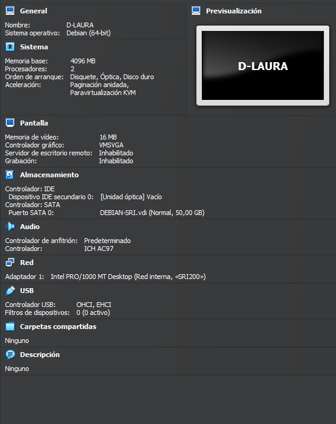

 Al servidor se le asigna la dirección IP 10.0.200.2, configurando también la puerta de enlace predeterminada como 10.0.200.1 (la dirección IP del router) y usando el DNS del instituto. La configuración de red se realiza en el archivo /etc/network/interfaces.

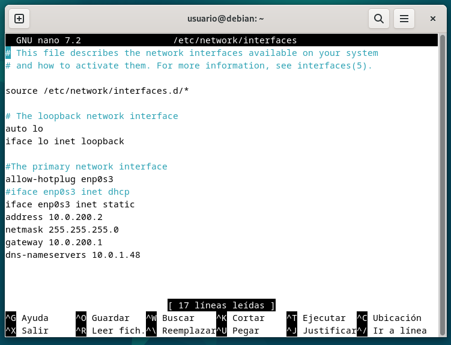

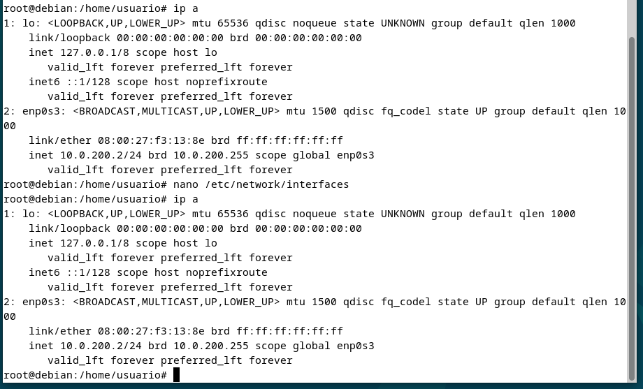

Para verificar si hay conectividad, hacemos un ping al sitio web www.google.es. Esto nos confirma si la máquina puede navegar por Internet.

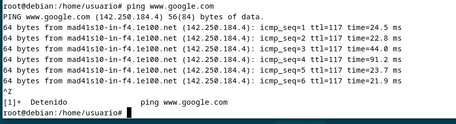

## Ejercicio 1

**Servidor Debian:**

En este paso, instalamos el paquete isc-dhcp-server en la máquina Debian que actúa como servidor. Utilizamos el siguiente comando para llevar a cabo la instalación:

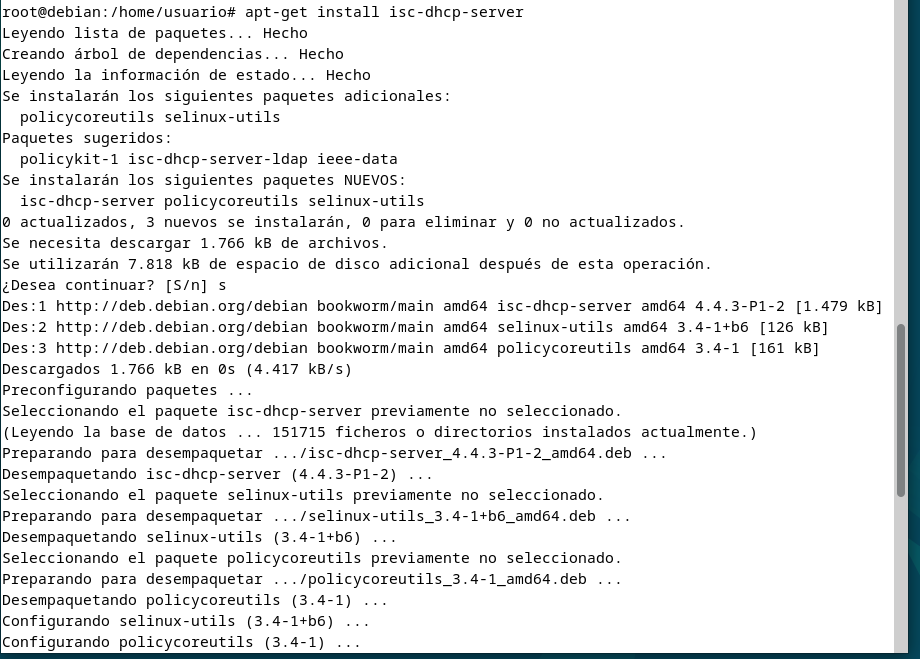

Después de la instalación, ejecutamos el comando ss -ltun para obtener información detallada sobre las conexiones de red activas.

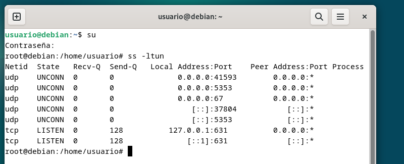

Para que el servidor DHCP funcione correctamente, es necesario configurar las interfaces de red en las que estará activo. Esto se realiza editando el archivo /etc/default/isc-dhcp-server, donde añadimos la interfaz enp0s3 a interfacesv4.

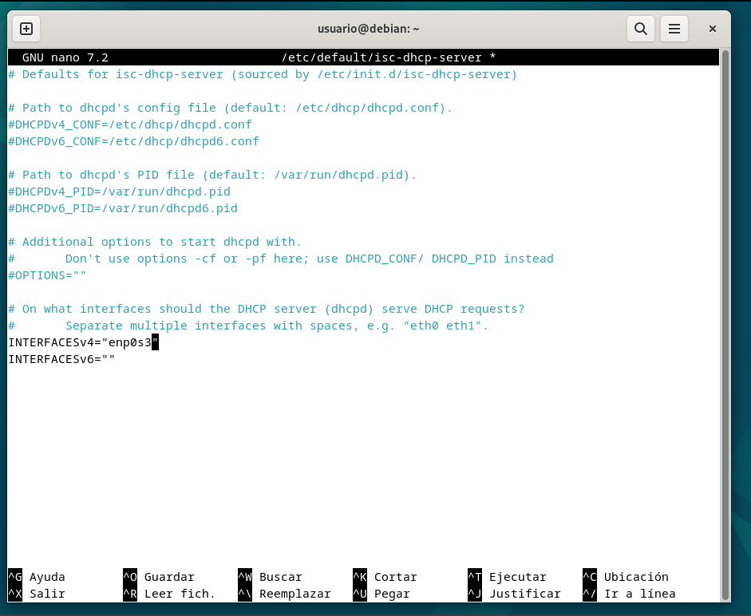

Configuraciones adicionales para cumplir los requisitos:

Para entrar a la ocnfiguracion de los requisitos entraremos en /etc/dhcp/dhcpd.conf 
y según entramos nos encontramos con este fichero 
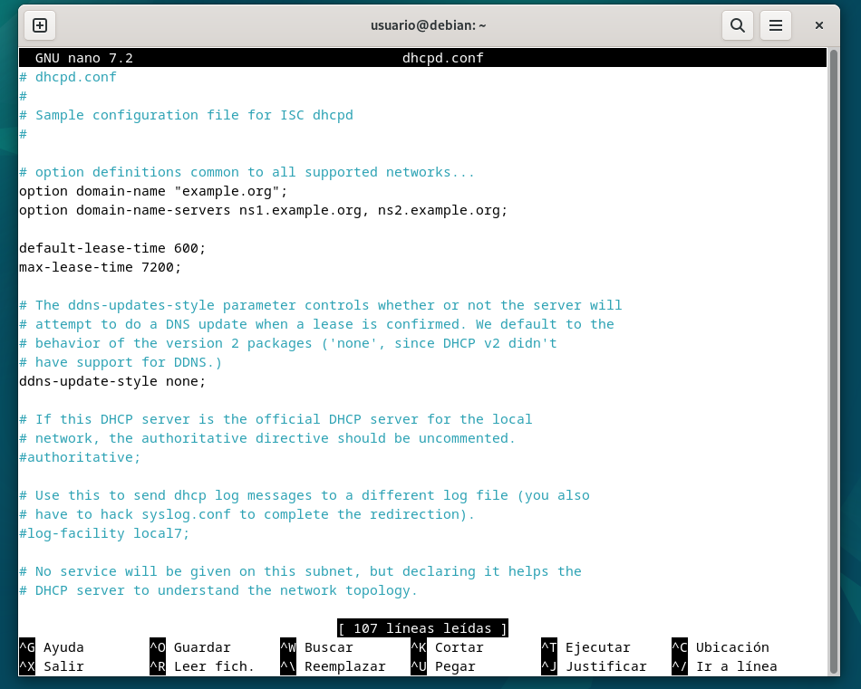

A continuación, editamos el archivo principal de configuración del servidor DHCP, que se encuentra en /etc/dhcp/dhcpd.conf. Realizamos las siguientes configuraciones específicas:

- Asignamos direcciones IP en el rango 10.0.200.3 - 10.0.200.100, ya que las direcciones 10.0.200.1 y 10.0.200.2 están reservadas para el router y el servidor, respectivamente.
- Establecemos la máscara de subred en 255.255.255.0.
- La puerta de enlace predeterminada será 10.0.200.1.
- El DNS utilizado será el del instituto.
- El sufijo DNS será sri200.local.
- El tiempo de alquiler será 15 días por defecto, con un máximo de 30 días y un mínimo de 1 semana.

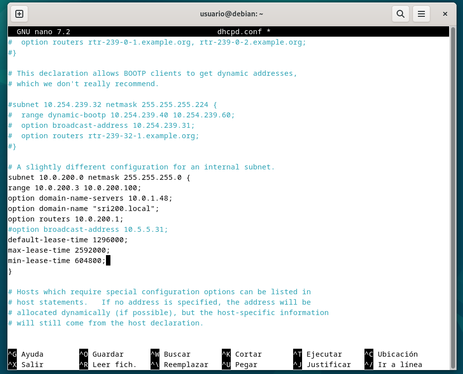

- Reservamos la dirección 10.0.200.60 para el cliente Linux
  
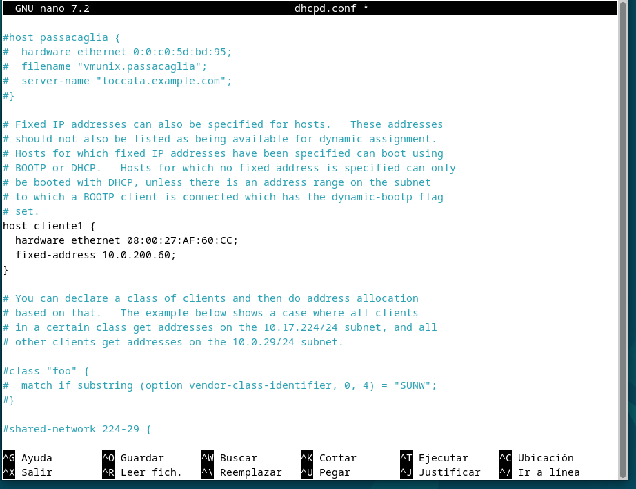

- Una vez configurado todo, reiniciamos el servicio para aplicar los cambios.
  

- Finalmente, comprobamos que el servicio DHCP está activo y en ejecución correcta.
  
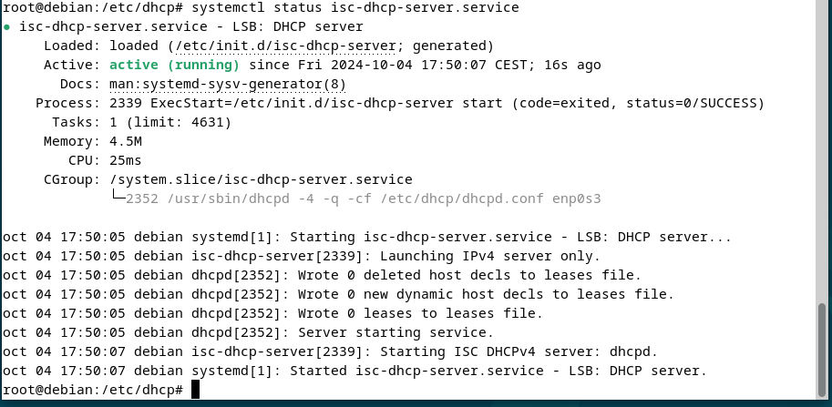

## Ejercicio 2

**Windows:**

Configuramos la máquina cliente con Windows para que obtenga su dirección IP a través del servidor DHCP.

Ejecutamos el comando ipconfig /all para obtener la configuración completa de la red y verificar que el cliente haya obtenido la dirección IP correctamente.

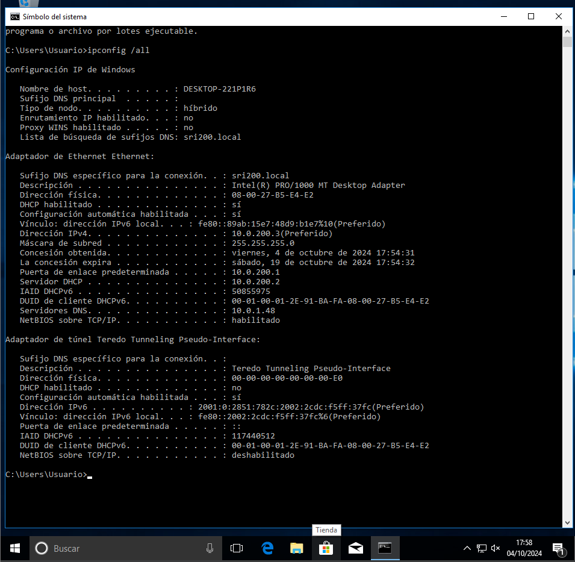

Hacemos un ping a la máquina Linux para comprobar la conectividad entre las máquinas en la red interna. Además, hacemos un ping a Google para confirmar la conexión a Internet.

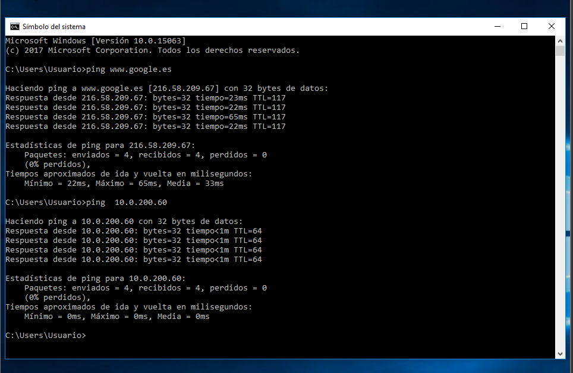

**Linux**

Al igual que en Windows, configuramos el cliente Linux para que obtenga su dirección IP de forma dinámica a través del servidor DHCP. Esto se realiza editando el fichero /etc/network/interfaces.

Utilizamos el comando ip a para revisar la configuración de red, y cat /etc/resolv.conf para comprobar los DNS asignados.

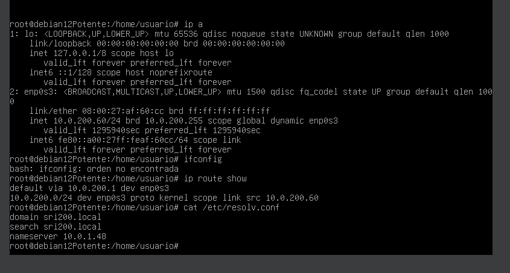

Hacemos un ping a la máquina Windows para comprobar que ambas máquinas se pueden comunicar. Luego, verificamos la conexión a Internet haciendo un ping a Google.

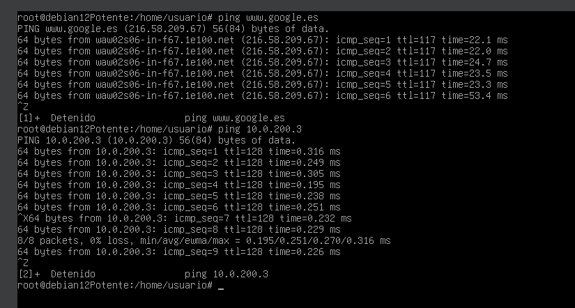

## Ejercicio 3

Utilizamos el comando journalctl -f -u isc-dhcp-server para observar los mensajes de log del servidor DHCP en tiempo real.

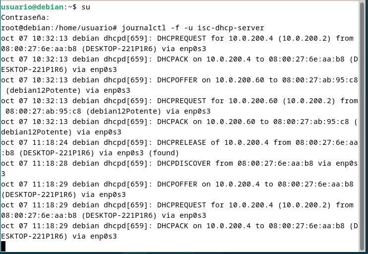

- DHCPDISCOVER:

Es el mensaje que envía un cliente cuando está buscando un servidor DHCP en la red para solicitar una dirección IP.

- DHCPOFFER:

 El servidor DHCP responde a la solicitud DHCPDISCOVER con este mensaje, ofreciendo una dirección IP al cliente.

- DHCPREQUEST:

Una vez el cliente recibe una oferta de dirección IP, envía este mensaje para solicitar formalmente la dirección IP ofrecida.

- DHCPACK:

El servidor DHCP confirma la asignación de la dirección IP al cliente con este mensaje, indicando que ya puede ser utilizada.
